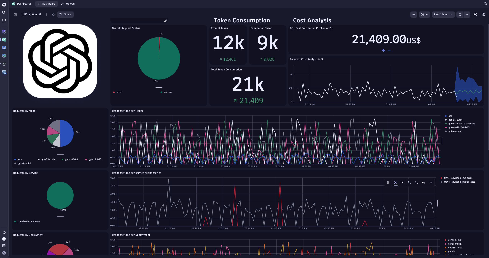

## Pre-requisite

A Dynatrace Token with the following scopes:

-	Ingest events
-	Ingest logs
-	Ingest metrics
-	Read metrics
-	Ingest OpenTelemetry traces

You can then store it as a secret using the following `kubectl` command

```bash
kubectl create secret generic dynatrace --from-literal token=dt0c01.<DT_TOKEN> -n travel-advisor-azure
```

Similarly, an Azure OpenAI key and endpoint:

```bash
 kubectl create secret generic azure --from-literal key=<AZURE_OPENAI_KEY> --from-literal endpoint=<AZURE_OPENAI_ENDPOINT>  -n travel-advisor-azure
```

## Deployment 

You can build your own container and patch the deployment file to use your own image tag.
Similarly, you can set the URL where to send the OpenTelemetry signals by patching the Env Var `OTEL_ENDPOINT` with your own value.
Then, you can run the following command to deploy the application.

```bash
kubectl apply -f k8s
```

## Observability

You can import the OpenAI dashboard available in the [dashboard](./dashboard) directory to have out of the box observability of key metrics of your OpenAI application.

